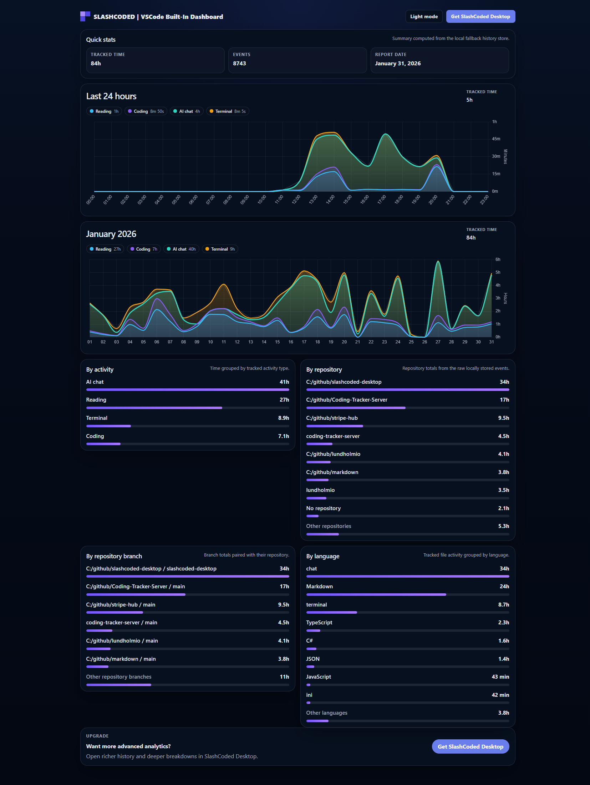
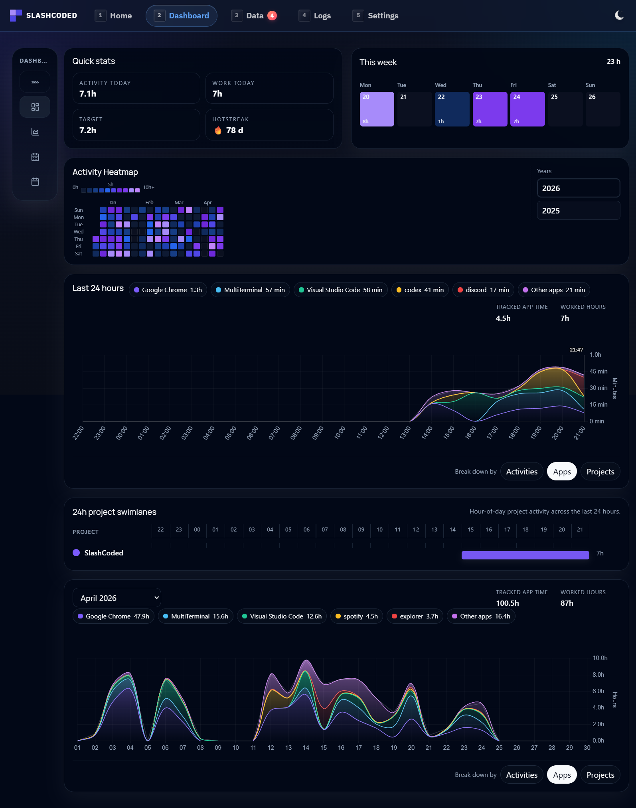

# SlashCoded for VS Code

SlashCoded is a free, advanced coding tracker for VS Code. It measures coding activity and turns it into useful local reporting data. It is designed for the [SlashCoded Desktop](https://lundholm.io/projects/slashcoded?ref=vscodeext) ecosystem, where the extension acts as an activity producer and sends events to the desktop app's local ingest service.

The extension can also run on its own. If SlashCoded Desktop is not installed, SlashCoded stores activity locally and shows it in the built-in dashboard. There is no cloud upload path in this extension.

SlashCoded is a fork of the original work by [LiuYue (hangxingliu)](https://github.com/hangxingliu). This version expands tracking beyond editor activity with terminal and AI chat detection, including GitHub Copilot, Codex, Claude, and other focused AI chat panels.

## Measured Activities

SlashCoded detects the active work mode in VS Code and records the following activity types:

- Reading: a file is open and focused in the editor
- Writing: a focused editor file is actively being edited
- Terminal: the integrated terminal is focused
- AI chat: an AI chat panel is focused
- Idle: the VS Code window is not focused
- AFK: VS Code has had no user activity for the configured idle period

Highlights:
- Tracks terminal usage, AI chat conversations, and reading vs writing inside VS Code
- Shows the active mode and upload queue in the status bar
- Stores local activity history when SlashCoded Desktop is not installed
- Opens a built-in local dashboard for standalone use
- Uploads events to SlashCoded Desktop when its local API is discovered

## Screenshots

### Built-In Dashboard

### SlashCoded Desktop

## Features

- Status bar with exclusive mode and upload queue insights
- Exclusive modes for coding, watching, terminal, chat, and AFK
- AFK detection with automatic pause/resume
- Terminal activity tracking with command execution timelines
- AI chat tracking across providers with context-key heuristics and focus-aware detection
- Built-in fallback summary dashboard grouped by activity, repository, repository branch, and language
- Desktop discovery, standalone local storage, and upload timeout controls

## Useful Commands

- `SlashCoded: Show Local Report` opens the built-in local summary dashboard
- `SlashCoded: Show Sync Status` shows Desktop connectivity, queue depth, and maintenance actions
- `SlashCoded: Import Local History into Desktop` moves local-only fallback history into the upload queue
- `SlashCoded: Show Output Channel` opens the extension log/output stream

### Manually Flush The Upload Queue

If uploads get stuck and the status bar shows a growing queue count, you can force a retry:

- Click the status bar item, or
- Run `SlashCoded: Show Sync Status` and choose `Force upload queued events now`

## Quick Start

1. Install the extension from the Marketplace or a VSIX.
2. If SlashCoded Desktop is installed, start it so the extension can discover the local API.
3. If SlashCoded Desktop is not installed, use `SlashCoded: Show Local Report` for the built-in local dashboard.
4. To import standalone history into Desktop later, run `SlashCoded: Import Local History into Desktop`.
5. Use `SlashCoded: Show Sync Status` to confirm Desktop discovery.

## Configuration

Settings are under Preferences -> Settings -> SlashCoded:

- `slashCoded.storageMode`: `auto` uses SlashCoded Desktop when detected and local history otherwise; `standalone` always uses the built-in local dashboard
- `slashCoded.showStatus`: show or hide the status bar item
- `slashCoded.shouldTrackTerminal`: include terminal activity
- `slashCoded.shouldTrackAIChat`: include AI chat activity
- `slashCoded.afkEnabled`: pause or classify tracking when VS Code is idle
- `slashCoded.uploadTimeoutMs`: local Desktop API upload timeout in milliseconds
- `slashCoded.desktopDiscoveryTimeoutMs`: local Desktop discovery timeout in milliseconds

## SlashCoded Desktop

1. Download the Windows installer from https://lundholm.io/projects/slashcoded?ref=vscodeext.
2. Run the installer.
3. Start the desktop app before launching VS Code so the extension discovers it automatically.
4. Use `SlashCoded: Show Sync Status` if Desktop starts after VS Code.
5. To import standalone history into Desktop, run `SlashCoded: Import Local History into Desktop`.

## Development

This repo targets Node.js 22.x for building and packaging.

1. Use Node 22, for example with `nvm use`.
2. Install dependencies with `npm install`.
3. Run tests with `npm run test:node`.
4. Package with `npm run package`.

The package script creates `SlashCoded-VSCode-Extension.x.x.x.vsix` in the repo root.

## Credits

This project is a fork of the original work by [LiuYue (hangxingliu)](https://github.com/hangxingliu).

- Extension code and server scripts are licensed under [GPL-3.0](LICENSE)
- Third-party code keeps the license information in its source files
